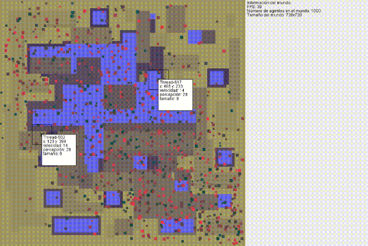

# Daniel Nieto - Other projects

### Project *"Trend patterns between consumption of fruits, vegetables, beef, pork, coffee and tobacco, with incidence of gastric cancer in Colombia"*

Finalists in the 4th researching contest Hernando Sarasti, promoted by the Colombian association of Oncology and Hematology (ACHO)

* **[See presentation](https://github.com/nietodaniel/repo/blob/main/presentacion%20(1).pdf)**
* **[See certificate](https://github.com/nietodaniel/repo/blob/main/PROYECTO%20535%20CERTIFICACION.pdf)**
* **[See scientific abstract](https://github.com/nietodaniel/repo/blob/main/Resumen.pdf)**

We used artificial intelligence techniques such as Self Organizing Maps (SOM), Kmeans clustering and hierarchical clustering to generate the profiles of asociation between the consumption of a variety of foods and substances and the stomach cancer index per capita

### Project *"Nature Engine: Simulator for evolution researchers"*

Project of the course MultiAgent Systems.

* **[See presentation](https://github.com/nietodaniel/repo/blob/main/NatureEngine-Disen%CC%83o.pdf)**

This project seeks to build a tool with the latest technological advances and optimizations, which permits evolution researches to expand their capabilities and projects to a new level. It was initially built in Java, then recoded to unity/C#
